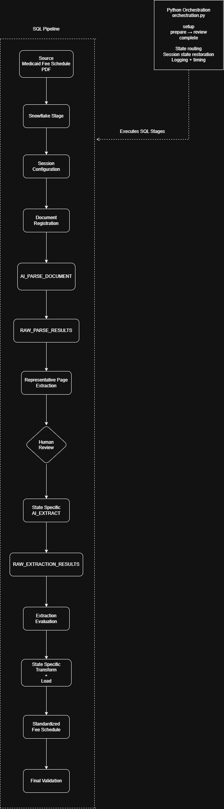

# AI-Enabled Snowflake Medicaid PDF Pipeline

Snowflake pipeline that extracts structured Medicaid fee schedule data from state PDF
documents using Snowflake Cortex `AI_PARSE_DOCUMENT` and `AI_EXTRACT`, and loads
standardized, per-state rows for downstream use.

## Project goal

This project evaluates whether Snowflake Cortex AI can support a reusable, validated workflow for converting differently structured Medicaid fee schedule PDFs into structured data.

The pipeline is intended as a proof of concept for analysts and developers working with Medicaid fee schedule data or similar semi-structured public documents. It emphasizes extraction quality, traceability, rerun safety, and human review rather than fully automated processing across every state.

## Repository structure

```text
.
├── orchestration.py
├── pyproject.toml
├── uv.lock
├── README.md
├── docs/
│   └── experiment_summary.md
├── sql/
│   ├── setup/
│   │   └── 01_create_tables.sql
│   ├── pipeline/
│   │   ├── 00_config.sql
│   │   ├── 01_register_document.sql
│   │   ├── 02_parse_and_store.sql
│   │   ├── 03_test_extraction_pages.sql
│   │   ├── 03a_NM_test_extraction_pages.sql
│   │   ├── 04_extract_and_store_results.sql
│   │   ├── 04a_NM_extract_and_store_results.sql
│   │   ├── 05_evaluate_extraction.sql
│   │   ├── 05a_NM_evaluate_extraction.sql
│   │   ├── 06_load_standardized_fee_schedule.sql
│   │   ├── 06a_NM_load_standardized_fee_schedule.sql
│   │   ├── 07_validate_standardized_load.sql
│   │   └── 07a_NM_validate_standardized_load.sql
│   ├── experiments/
│   │   ├── README.md
│   │   ├── batching/
│   │   ├── chunked_parsing/
│   │   ├── direct_extraction/
│   │   ├── page_count_udf/
│   │   ├── parse_baselines/
│   │   └── transformation/
│   └── validation/
│       ├── README.md
│       ├── 01_validate_representative_pages.sql
│       ├── 02_validate_stored_parse.sql
│       ├── 03_validate_batch_extraction.sql
│       └── 04_validate_transformation_extraction_results.sql
└── data/
    ├── raw/
    └── processed/
```

- `sql/pipeline/` contains the active ND and NM pipeline.
- `sql/experiments/` contains archived approaches retained for reference and future development.
- `sql/validation/` contains historical standalone validation scripts that are not part of the current orchestrated workflow.
- `docs/experiment_summary.md` summarizes the experiments, design decisions, limitations, and future development opportunities.
- `data/` is local-only and excluded from version control.


## Architecture
The Python orchestrator sequences the existing SQL pipeline, preserves a human-review checkpoint before full extraction, and routes ND and NM to their state-specific extraction, transformation, and validation scripts.





## Prerequisites
1. Stage `MEDICAID_FEE_SCHEDULE_PDFS` exists and contains the target state's fee schedule PDF.
2. Required setup tables have been created (`sql/setup/01_create_tables.sql`).
3. The target database, schema, and warehouse are available.
4. `DATABASE`, `SCHEMA`, and `WAREHOUSE` are set before running any pipeline script, e.g.:
   ```sql
   USE DATABASE <DB_NAME>;
   USE SCHEMA <SCHEMA_NAME>;
   USE WAREHOUSE <WAREHOUSE_NAME>;
   ```

Shared SQL in this repo should stay environment-agnostic and avoid hardcoded personal dev
object names.

## Python Orchestration

This project includes a lightweight Python orchestrator (`orchestration.py`) that sequences the SQL pipeline steps and surfaces useful validation results. It requires Python 3.14+ and the Snowflake connector.

### Installation
1. Ensure `uv` is installed (Python package manager).
2. Install dependencies:
   ```bash
   uv sync
   ```
3. Set Snowflake environment variables:
   ```bash
   export SNOWFLAKE_USER="<your_username>"
   export SNOWFLAKE_ACCOUNT="<your_account>"
   export SNOWFLAKE_DATABASE="<your_database>"
   export SNOWFLAKE_SCHEMA="<your_schema>"
   export SNOWFLAKE_WAREHOUSE="<your_warehouse>"
   ```

### Workflow

After one-time setup, the pipeline uses a two-step execution workflow with a human-review checkpoint.

### One-Time Setup
```bash
uv run orchestration.py setup
```
Runs required one-time initialization: creates tables and configures the Snowflake session.

#### Step 1: Prepare
```bash
uv run orchestration.py prepare
```
This phase:
1. Configures the Snowflake session
2. Registers the document in the catalog
3. Parses the document using Snowflake's AI functions
4. Tests extraction on representative pages

**Intentionally stops here** to allow human review of representative-page extraction results (confidence scores, row counts, pass/fail status) before proceeding to full extraction.

#### Step 2: Complete
```bash
uv run orchestration.py complete
```
This phase:
1. Restores the DOCUMENT_ID and PARSE_RUN_ID from the prepare phase
2. Runs full extraction on all document pages
3. Evaluates extraction quality
4. Loads results into the standardized table
5. Validates the standardized load

### How It Works

- **Result Filtering:** The orchestrator filters SQL output to surface useful validation results while hiding noise (execution messages, large JSON objects, hundreds of rows, etc.).
- **Session State Preservation:** Each phase runs in a separate Python/Snowflake session. The `complete` phase automatically restores DOCUMENT_ID and PARSE_RUN_ID from the database so you can run it independently after `prepare`.
- **SQL Independence:** All SQL files remain independently runnable in Snowflake if needed.
- **Logging:** Progress is logged to the terminal and to `logs/pipeline.log` with execution timing for each stage.

## Execution Order
Each pipeline script contains its own inline validation/review queries, run as part of the
same script after the load/extract steps. The `sql/validation/` folder is **not** part of
this order — see [Note on `sql/validation/`](#note-on-sqlvalidation) below.

1. `sql/setup/01_create_tables.sql` (one-time)
2. `sql/pipeline/00_config.sql`
3. `sql/pipeline/01_register_document.sql`
4. `sql/pipeline/02_parse_and_store.sql`
5. `sql/pipeline/03_test_extraction_pages.sql` (ND) or `03a_NM_test_extraction_pages.sql` (NM)
6. `sql/pipeline/04_extract_and_store_results.sql` (ND) or `04a_NM_extract_and_store_results.sql` (NM)
7. `sql/pipeline/05_evaluate_extraction.sql` (ND) or `05a_NM_evaluate_extraction.sql` (NM)
8. `sql/pipeline/06_load_standardized_fee_schedule.sql` (ND) or `06a_NM_load_standardized_fee_schedule.sql` (NM)
9. `sql/pipeline/07_validate_standardized_load.sql` (ND) or `07a_NM_validate_standardized_load.sql` (NM)

## State-Specific Scripts
Steps 5-9 have a state-specific pair: the base file (e.g., `04_extract_and_store_results.sql`)
targets ND's 3-column schema, and the `a`-suffixed sibling (e.g., `04a_NM_extract_and_store_results.sql`)
targets NM's 8-column schema. Adding a new state means adding a new suffixed set of these
scripts and a new `STANDARDIZED_FEE_SCHEDULE_<STATE>` table in `sql/setup/01_create_tables.sql`.

## Archived experiments
Archived development experiments are organized by technique under `sql/experiments/`. These scripts are not required for the current pipeline and may invoke Snowflake AI functions if run.

See [`sql/experiments/README.md`](sql/experiments/README.md) for the available experiments and their intended use.

## Note on `sql/validation/`
The scripts in `sql/validation/` were used for standalone validation and inspection during earlier development. They are retained for reference but are not part of the current orchestrated workflow.

Required validation and review checks are now included directly in the active `sql/pipeline/` scripts.

## Expected Results
- Registration creates a record for a new file version and skips existing versions.
- Full-document parsing stores a successful parse for the registered document and reports
  the latest successful parse (validation is inline in `02_parse_and_store.sql`).
- Extraction processes the stored document content and persists the extraction result.
- Evaluation checks extraction confidence, array-length consistency, and value quality.
- Loading transforms successful extraction results into the standardized table.
- Standardized-load validation reconciles row counts, dedupe keys, and field quality.

## Rerun Safety
- Registration deduplicates by relative path and file MD5.
- Full-document parsing avoids recreating an existing successful parse.
- Extraction and loading skip pages/rows already stored for the same
  document/parse/schema/extraction version.

## Limitations and future development

The current pipeline supports ND and NM using state-specific extraction and transformation logic. Additional state documents may require new schemas and validation rules, and large-document strategies such as chunked parsing remain experimental.

See [`docs/experiment_summary.md`](docs/experiment_summary.md) for experiment results, known limitations, archived approaches, and future development opportunities.
